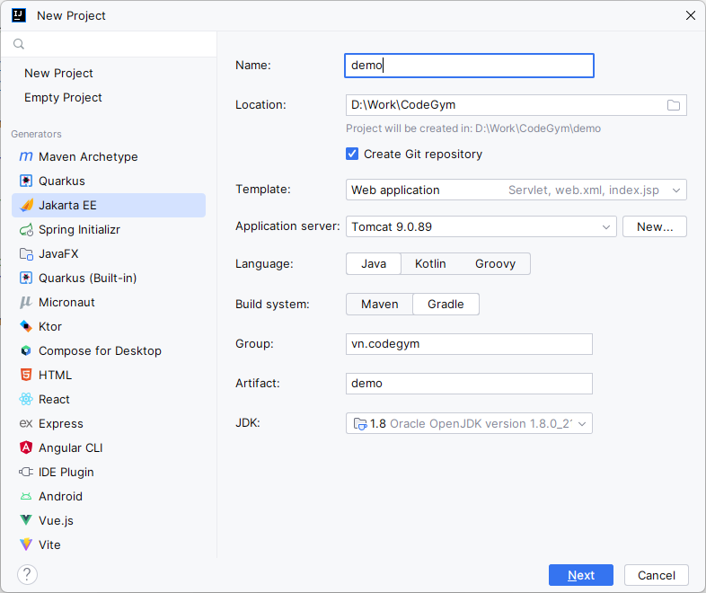
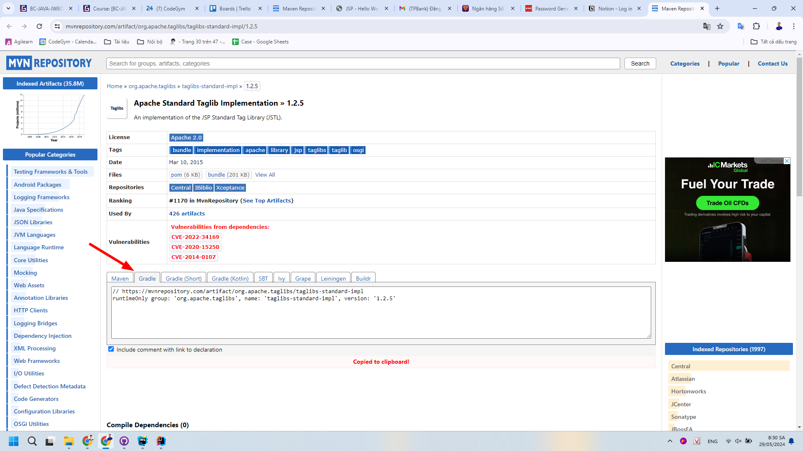
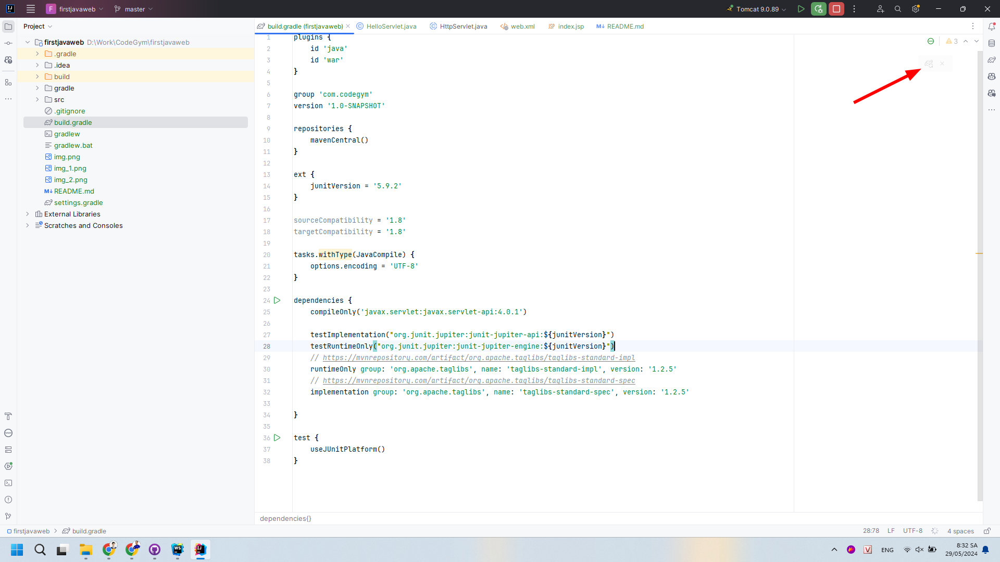

# Hướng dẫn tạo dự án với thư viện JSP - Standard Tag Library (JSTL)

## 1. Tạo dự án mới

Bước 1: Mở IntelliJ IDEA và chọn **New** => **Project**.

Bước 2: Chọn Jakarta EE nhập các thông tin cần thiết như tên dự án, đường dẫn, phiên bản Java, Application Server.

- Template: Web Application
- Application Server: Tomcat 9.0.89
- Language: Java
- Build system: Gradle
- Group: `vn.codegym`
- Artifact: `demo`
- JDK: `1.8`



Sau đó bấm **Next**. Đợi cho quá trình tạo dự án hoàn tất.

## 2. Thêm các thư viện cần thiết

Truy cập vào trang [Maven Repository](https://mvnrepository.com/) để tìm kiếm 2 thư viện cần thiết cho dự án là `taglibs-standard-impl` và `taglibs-standard-spec`. Hoặc bâm vào các link sau:

- https://mvnrepository.com/artifact/org.apache.taglibs/taglibs-standard-impl/1.2.5
- https://mvnrepository.com/artifact/org.apache.taglibs/taglibs-standard-spec/1.2.5



Bấm vào tab `Gradle` để sao chép đoạn mã cần thiết vào file `build.gradle`.

```gradle
// https://mvnrepository.com/artifact/org.apache.taglibs/taglibs-standard-impl
runtimeOnly group: 'org.apache.taglibs', name: 'taglibs-standard-impl', version: '1.2.5'

// https://mvnrepository.com/artifact/org.apache.taglibs/taglibs-standard-spec
implementation group: 'org.apache.taglibs', name: 'taglibs-standard-spec', version: '1.2.5'
```



Bấm vào biểu tượng  trên góc phải màn hình để cập nhật thư viện.


